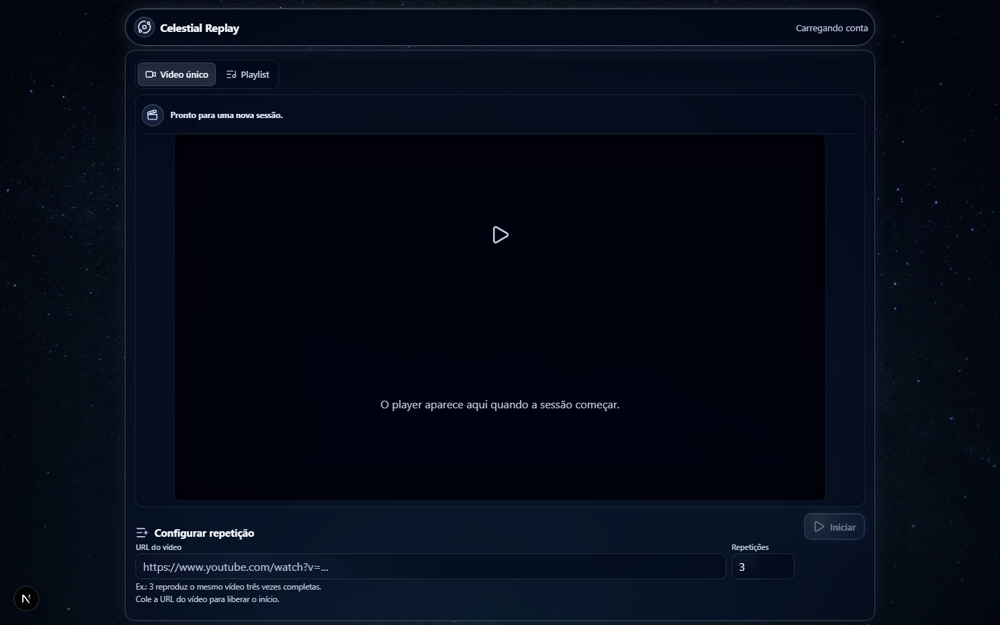

# Celestial Replay

Um player pessoal para repetir um vídeo ou executar uma playlist com uma quantidade exata de repetições por item.

O player funciona sem conta. Ao entrar, a pessoa pode salvar playlists, consultar um histórico privado e retomar uma sessão em outro dispositivo.



## Captura

Interface principal em desktop: prévia sem autoplay, player central, controles de sessão e formulário de repetição na mesma superfície. A interface é responsiva; no mobile os controles prioritários ficam em uma linha e as preferências usam um bottom sheet.

## O que o projeto demonstra

- Loop de mídia com regras explícitas: `3` significa três execuções completas, não três execuções adicionais.
- Playlists em dois formatos: linhas (`link;quantidade`) ou campos por vídeo.
- Prévia do primeiro vídeo sem autoplay; a reprodução começa apenas após uma ação da pessoa.
- Fila editável durante a execução, com itens futuros reordenáveis e repetíveis.
- Persistência de playlists, histórico e sessão somente para a conta autenticada.
- Player persistente ao navegar entre a biblioteca e o histórico.
- Interface escura, compacta e acessível, com atmosfera celestial e superfícies de liquid glass.

## Stack

- Next.js 16, React 19 e TypeScript
- ReactPlayer 3 para provedores de mídia
- Neon Postgres e Drizzle ORM
- Neon Auth para e-mail/senha e Google
- Upstash Redis para rate limit distribuído
- Zod para validação de payloads
- Lucide React e CSS próprio para a interface

## Arquitetura

```text
Navegador
  ├─ player e interface React
  ├─ Neon Auth via cookies seguros
  └─ /api/* no Next.js
       ├─ validação Zod + mesma origem + rate limit
       ├─ Neon Postgres: playlists, histórico e sessão
       └─ Upstash Redis: limites distribuídos
```

As rotas de dados derivam a identidade da sessão no servidor; o cliente nunca envia `ownerId`. Leituras, atualizações e exclusões são sempre escopadas ao dono do recurso.

### Fluxo de reprodução

```text
Entrada validada → prévia do primeiro item → gesto explícito em “Iniciar”
      ↓
ReactPlayer v3 / provider → evento de início → contador ativo
      ↓
evento de término → próxima repetição ou próximo vídeo → histórico ao concluir
```

## Regras de reprodução

1. Uma repetição só é contabilizada depois de uma execução completa.
2. A playlist só avança após finalizar todas as repetições do vídeo atual.
3. Carregar a prévia não inicia áudio ou vídeo.
4. Falhas de provider não devem avançar fila, histórico ou contador.
5. O comportamento de autoplay entre vídeos externos pode ser limitado pelo navegador e pelo provedor, especialmente com a aba em segundo plano.

## Ações rápidas

- **Repetir:** cada item do histórico abre o player já preenchido com a URL e a quantidade concluída.
- **Duplicar playlist:** a biblioteca duplica uma playlist com um clique, preservando os itens para edição.
- **Reproduzir novamente:** ao concluir uma fila, o player permite reiniciá-la sem remontar os itens.

## Estados e recuperação

- Skeletons são usados enquanto biblioteca, histórico e metadados da fila carregam.
- O player mostra um estado compacto de preparação sem esconder o vídeo do provider.
- As falhas orientam por tipo de fonte: YouTube, Vimeo, streams HLS/DASH e arquivos diretos apresentam próximos passos apropriados.

## Desenvolvimento local

```bash
npm install
npm run dev
```

Crie `.env.local` com as credenciais do ambiente seguro:

```text
DATABASE_URL=
NEON_AUTH_BASE_URL=
NEON_AUTH_COOKIE_SECRET=
KV_REST_API_URL=
KV_REST_API_TOKEN=
APP_ORIGIN=http://localhost:3000
```

Para autenticação, configure `http://localhost:3000` e o domínio de produção como trusted origins no Neon Auth. Mais detalhes estão em [NEON_AUTH_SETUP.md](./NEON_AUTH_SETUP.md).

## Qualidade e banco

```bash
npm run verify       # TypeScript + bateria de URLs suportadas
npm run build        # bundle de produção
npm run db:generate  # gera uma migration após alteração de schema
npm run db:migrate   # aplica migrations no banco autorizado
```

As migrations em `drizzle/` são versionadas, mas não são aplicadas automaticamente no deploy. Revise o SQL antes de executar qualquer migration em produção.

## Segurança

- Sessão via cookies do Neon Auth; não há credenciais no `localStorage`.
- Mutação de dados exige mesma origem, usuário autenticado, validação e ownership.
- URLs de imagem são rejeitadas como mídia reproduzível.
- Headers de segurança e CSP estão configurados no Next.js.
- Rate limits usam Redis compartilhado quando configurado.

Consulte [SECURITY_ROADMAP.md](./SECURITY_ROADMAP.md) para melhorias e verificações pendentes antes de abrir o produto ao público.

## Estrutura relevante

```text
app/api/                 Rotas de backend e autorização
components/replay-*      Player, controles e montagem de fila
components/playlists/    Biblioteca e editor de playlists
components/history/      Filtros e apresentação do histórico
lib/                     Regras puras, banco, autenticação e segurança
drizzle/                 Migrations versionadas
```

## Decisões técnicas importantes

### ReactPlayer v3 e ciclo de vida

O ReactPlayer v3 expõe elementos de mídia/custom elements. O encaminhamento correto de `ref`, o gesto de play e o ciclo de vida do player são tratados como invariantes: uma repetição só é contada após `onPlaying`, e erros não avançam a fila.

### Segurança de dados

O browser não escolhe o dono de uma playlist. A API obtém a pessoa autenticada no servidor e aplica o escopo de ownership em toda leitura e mutação. Sessões usam cookies do Neon Auth em vez de credenciais no `localStorage`.

### Persistência entre páginas

O shell persistente mantém a instância de mídia fora das páginas de biblioteca e histórico. Isso evita reiniciar uma sessão por causa de navegação interna.

## Limitações conhecidas

- Provedores externos podem bloquear embed, autoplay ou troca de vídeo em segundo plano; isso depende das políticas do navegador e da plataforma.
- A duração estimada aparece somente quando o provider disponibiliza metadados ao browser.
- Playlists, histórico e retomada exigem conta; a reprodução avulsa continua disponível sem login.

Consulte [AGENTS.md](./AGENTS.md) antes de alterar `ReplayStudio`, `ReplayPlayerSurface` ou `react-player-client`.
